# HEXAGONAL ARCHITECTURE (+DDD, +CQRS, +Repositories)

## WHAT IS HEXAGONAL ARCHITECTURE?

Hexagonal architecture is a general-purpose architectural style that aims to create decoupled software

Other names that refer to the same software architecture concep:
* ports and adapters pattern
* clean architecture
* onion architecture


## HEXAGONAL AND OTHERS PATTERNS TOGETHER

* Hexagonal: For the main architecture and general concept.
* DDD (Domain Driven Design): 
  * For the division of the project into diferents components (following domain division based on entity aggregations).
  * For the inner logic of domain layer (entities, aggregations, events, valueobjects)
* CQRS: For the division of input ports into queries and commands.
* Repository pattern: For the dependency injection of the interface to the database.


## LAYERS

* External-systems/Framework layer
* Infrastructure
* Application
* Domain

The "core" of a hexagonal project is application and domain


## USEFUL LINKS

[Complete explanation for hexagonal+DDD](https://herbertograca.com/2017/11/16/explicit-architecture-01-ddd-hexagonal-onion-clean-cqrs-how-i-put-it-all-together/)

[Hexagonal and others related patterns](https://www.happycoders.eu/software-craftsmanship/hexagonal-architecture/)

## DIAGRAMS

### Image 1 - Hexagonal architecture

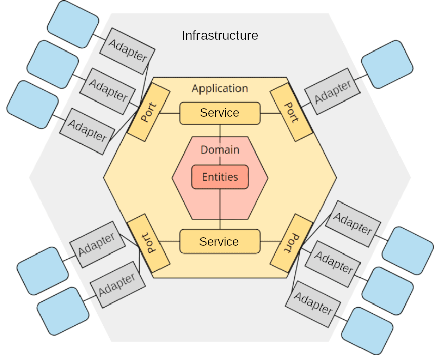

### Image 2 - Hexagonal architecture with microservices

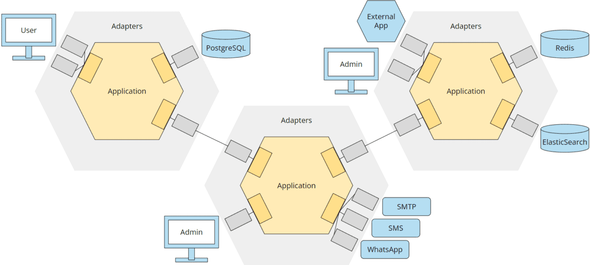

### Image 3 - Hexagonal architecture layers (following DDD layers naming)

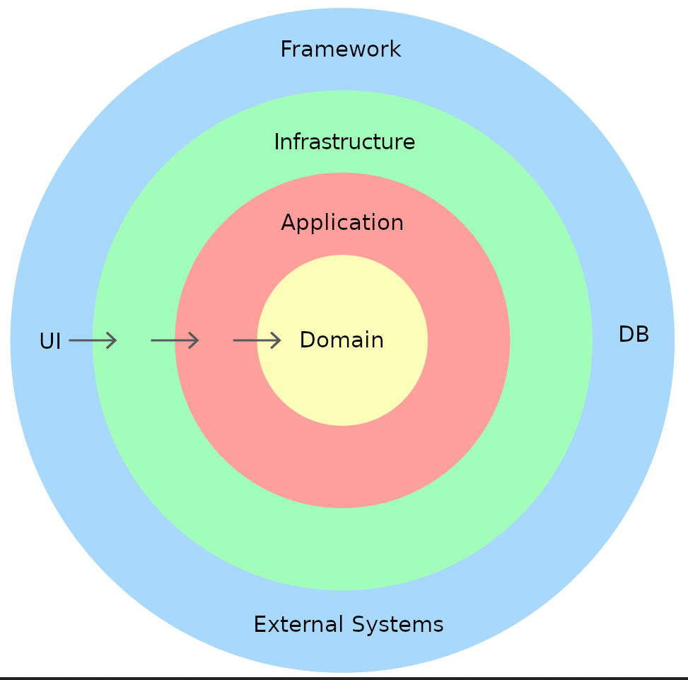

### Image 4 - Hexagonal architecture with DDD - Complete diagram

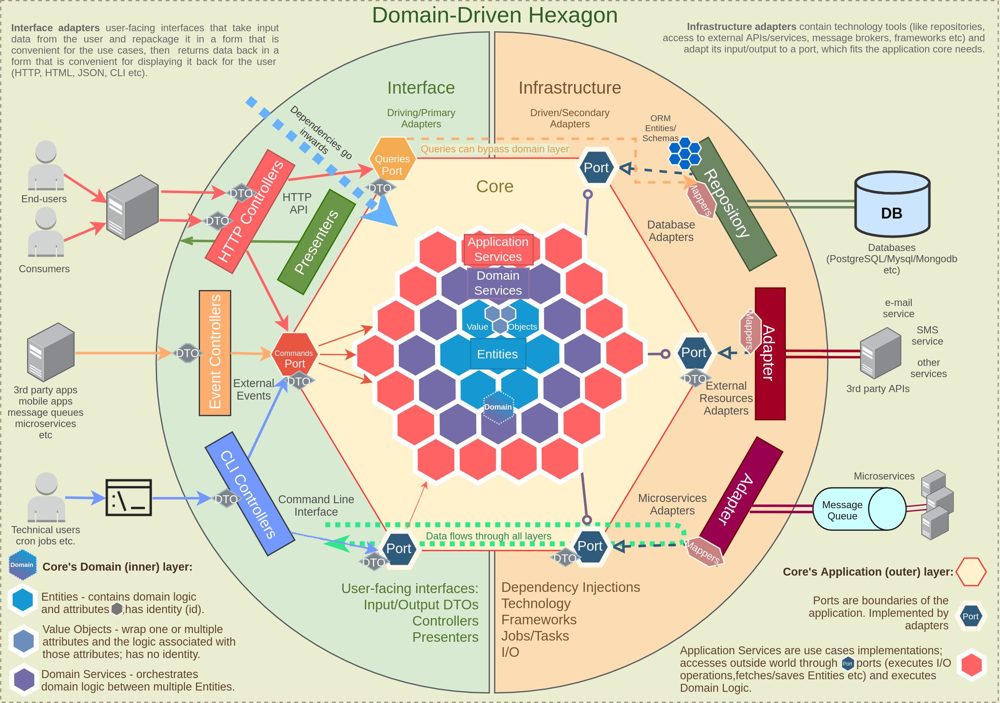

### Image 5 - Hexagonal architecture with DDD - Other complete diagram

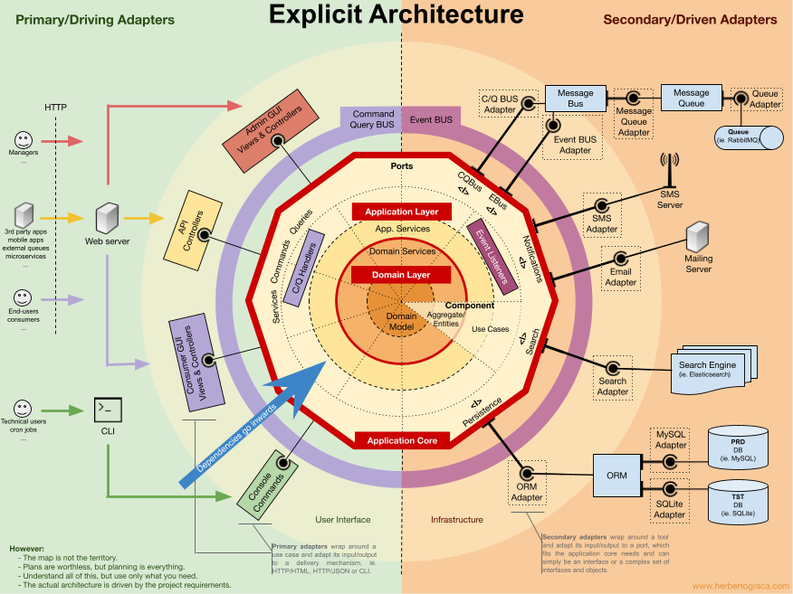

### Image 6 - Hexagonal architecture with DDD - Division of component

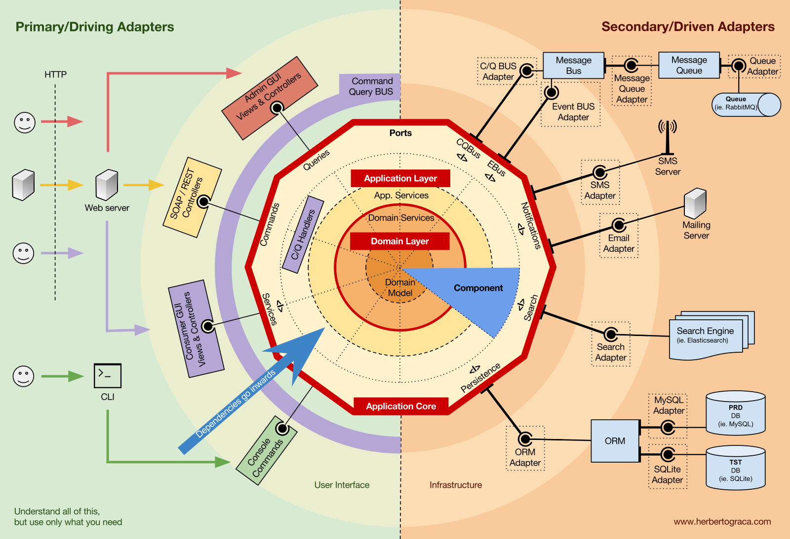

### Image 7 - Hexagonal architecture with DDD - Inner component structure

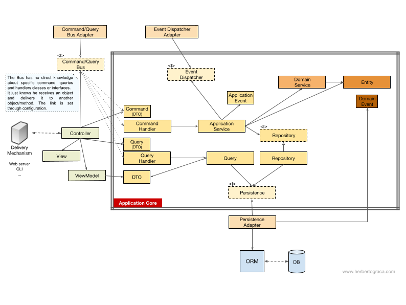

### Image 7 - Hexagonal architecture core

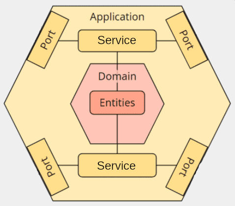

### Image 8 - Hexagonal core inner division in components

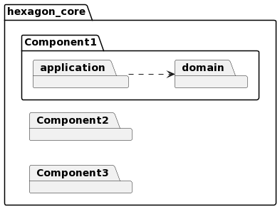

### Image 9 - Component's inner package diagram

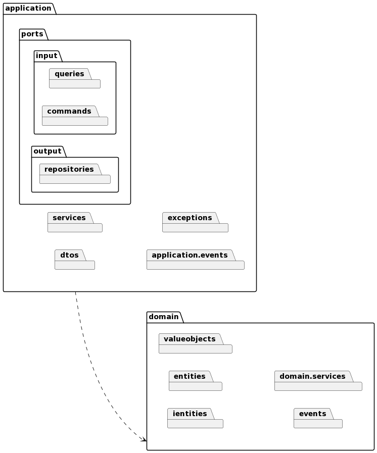

### Image 10 - Component's inner package diagram with dependencies

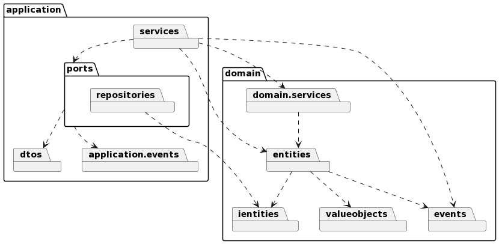

### Image 11 - Domain inner class diagram - DDD using aggregation pattern

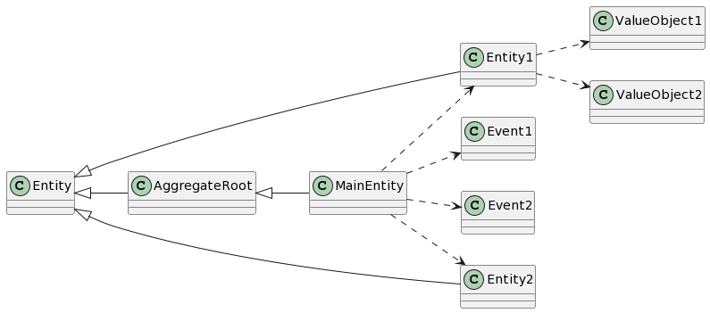


## FOLDER STRUCTURE

```bash
└── hexagonal_core
    ├── component_1
    │   ├── application
    │   └── domain
    └── component_2
        ├── application
        │   ├── dtos
        │   │   ├── input.py
        │   │   └── output.py
        │   ├── events
        │   ├── exceptions
        │   ├── ports
        │   │   ├── input
        │   │   │   ├── commands.py
        │   │   │   ├── others.py
        │   │   │   └── queries.py
        │   │   └── output
        │   │       ├── event_listeners.py
        │   │       ├── others.py
        │   │       └── repositories.py
        │   ├── services
        │   │   ├── commands.py
        │   │   ├── others.py
        │   │   └── queries.py
        │   └── utils
        └── domain
            ├── entities.py
            ├── events.py
            ├── exceptions.py
            ├── ientities.py
            ├── services.py
            ├── utils.py
            └── valueobjects.py

```