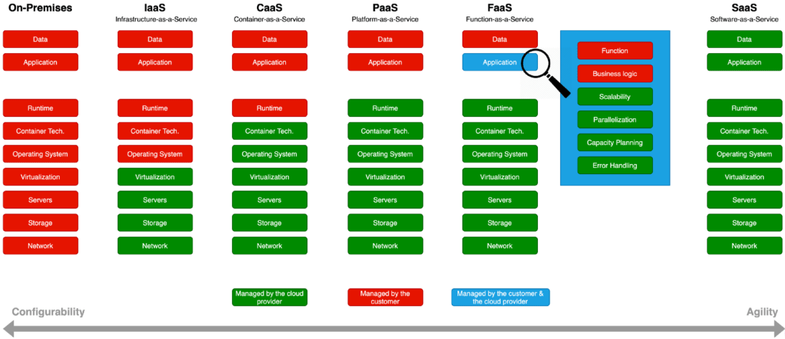
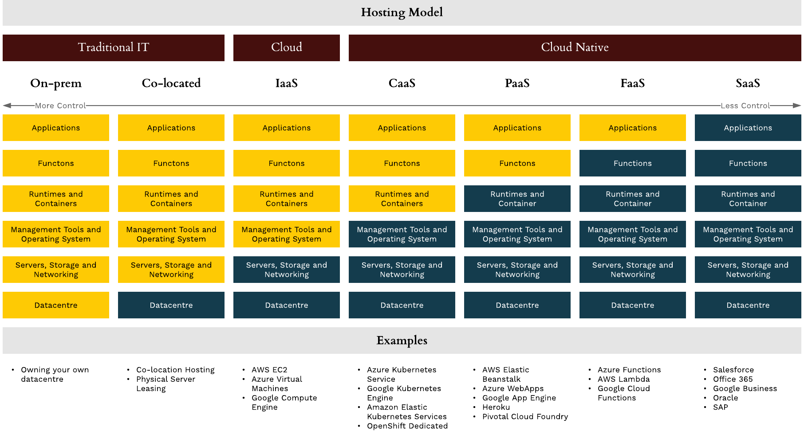
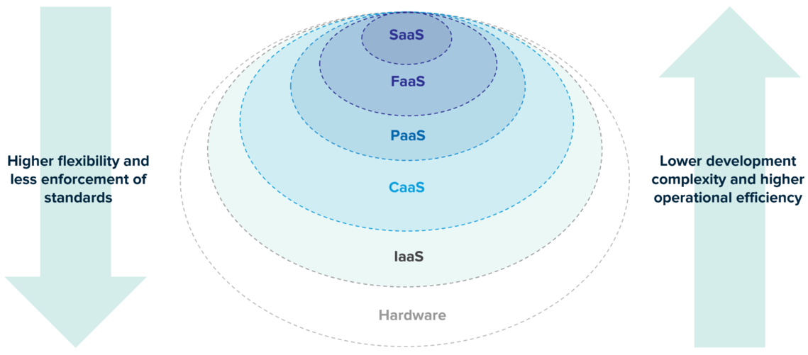
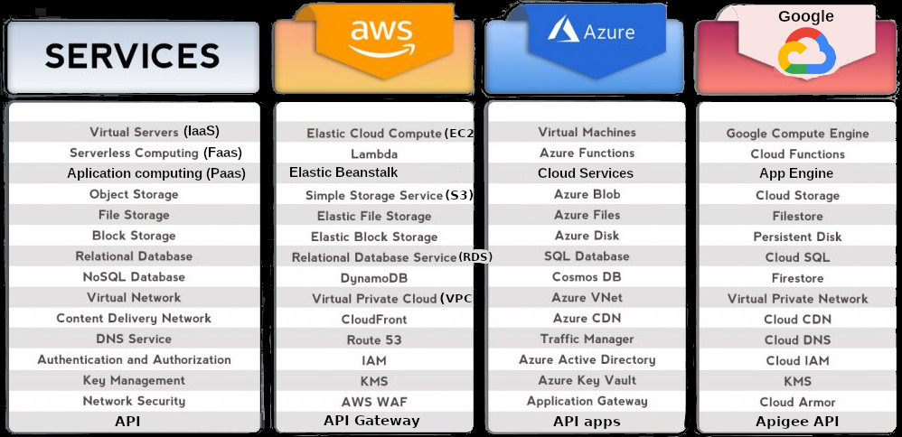
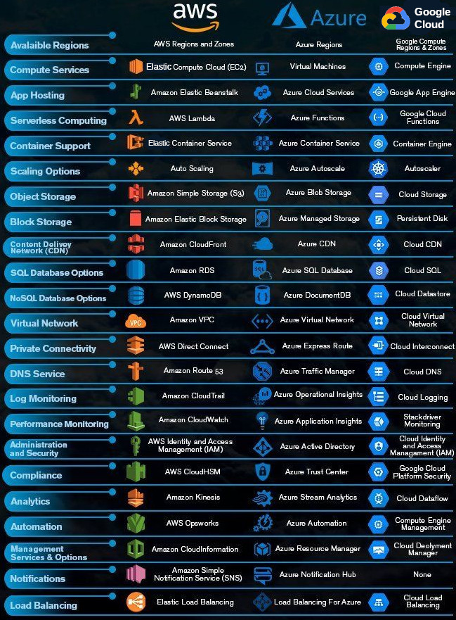
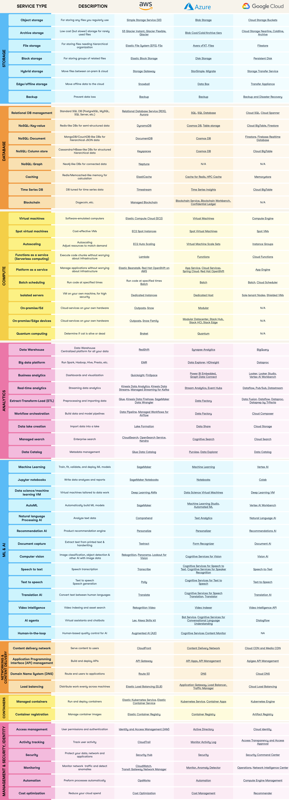

# CLOUD COMPUTING

## WHAT IS CLOUD COMPUTING?

Cloud computing is the on-demand availability of computing resources (such as storage, processing, database or infrastructure), as services over the internet. It eliminates the need for individuals to self-manage physical resources themselves (On-Premises infrastructure), and only pay for what they use.

## TERMS

* CSP: Cloud Solution Provider or Cloud Service Provider. E.g. AWS, Google Cloud Platform, Microsoft Azure
* GCP: Google Cloud Platform. The cloud of Google
* AWS: Amazon Web Services. The cloud of Amazon
* Microsoft Azure: The cloud of Microsoft

## TYPES OF CLOUD SERVICES

* IaaS - Infrastruture as a Service
* CaaS - Container as a Service ()
* PaaS - Platform as a Service (You just build the app)
* FaaS - Function as a Service (Serverless)
* SaaS - Software as a Service (Normal apps for users: Gmail, Office 365, Youtube)

### Table 1

### Table 2

### Table 3

### Graphical comparison

## CATEGORIES OF CLOUD SERVICES

* Computing
* Storage
* Databases
* Security
* Containers

## COMPARISON OF POPULAR CLOUD SERVICES 

### Table 1 - Most popular services

### Table 2 - Popular services

### Table 3 - All services

