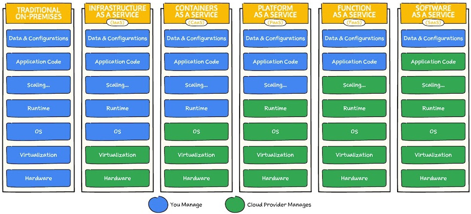

# CLOUD COMPUTING

## WHAT IS CLOUD COMPUTING?

Cloud computing is the on-demand availability of computing resources (such as storage, processing, database or infrastructure), as services over the internet. It eliminates the need for individuals to self-manage physical resources themselves (On-Premises infrastructure), and only pay for what they use.

## TERMS

* CSP: Cloud Solution Provider or Cloud Service Provider. E.g. AWS, Google Cloud Platform, Microsoft Azure
* SLA: Service Level Agreement: The agreement between the cloud service provider and the customers
* Elasticity: the ability of a system to adapt the changing workload demand to the resources
* Cloud native: an application that was designed to reside in the cloud from the start
* Private cloud: cloud accessible only to selected users of a single organization
* Public cloud: cloud accessible for all users over the internet, using pay-per-use access to services
* GCP: Google Cloud Platform. The cloud of Google
* AWS: Amazon Web Services. The cloud of Amazon
* Microsoft Azure: The cloud of Microsoft

## TYPES OF CLOUD SERVICES

* IaaS - Infrastruture as a Service (You manage the virtual machine)
* CaaS - Container as a Service (You manage the container (Docker, Kubernetes, ...))
* PaaS - Platform as a Service (You just build the app)
* FaaS - Function as a Service (Serverless)
* SaaS - Software as a Service (Normal apps for users: Gmail, Office 365, SAP, Youtube)

### Table 1

### Table 2

### Table 3

### Graphical comparison

## CATEGORIES OF CLOUD SERVICES

* Computing: Virtual machines, App computing, Serverless functions, etc
* Storage: Disk space for storing files (Objects (usually), archives (rarely), files (hierarchical))
* Database: Relational DB, NoSQL DB, Caching
* Security: Authorization, Permissions, Tracking users, Data protection
* Containers: Docker containers, Kubernetes
* Analytics: Bussiness analytics, Big Data, Data Warehouse, etc
* Machine learning & AI
* Networking: API, DNS, Load balancing, etc

## COMPARISON OF POPULAR CLOUD SERVICES 

AWS - AZURE - GOOGLE CLOUD

### Table 1 - Most popular services

### Table 2 - Popular services

### Table 3 - All services

## USEFUL LINKS

[AWS Best Practices](https://roadmap.sh/best-practices/aws)