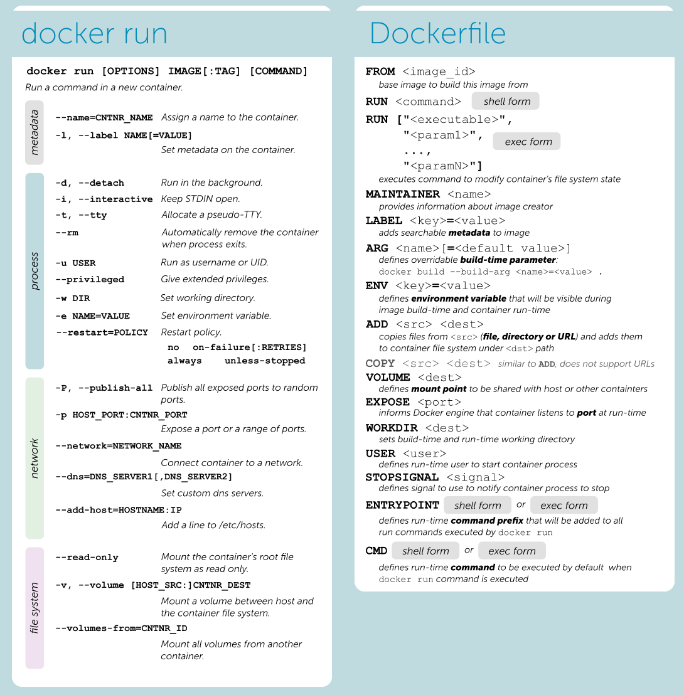

# Docker

## WHAT LEARN. DOs and DONTs

Do learn:
* Dockerfile
* Images
* Containers
* Registry (Docker Hub)
* Networks
* Volume
* Compose (compose.yaml)
* Context?
* Secrets?

Don't learn:
* Swarm -> better learn Kubernetes
* Stack (is part of swarm)
* Services  (is part of swarm)

## DEFINITIONS

## VIRTUALIZATION LEVELS: VIRTUAL ENVIRONMENT -> CONTAINER -> VIRTUAL MACHINE

<!--  -->

## DEFINITIONS

* Docker image: A read-only template containing all the necesary files, libraries, and dependencies required to run an application in a Docker container
* Docker container: A running instance of the image. That is, an executable packaging including the code, the libraries, and dependencies needed to run the application
* Dockerfile: A script containing instructions to build a image
* Docker compose file (compose.yaml): A definition of new different containers, networks, volumes, etc., and their relationships in a general structure.
* Docker registry: A repository for storing, sharing and managing Docker images. These include Docker Hub (The standard Docker registry), Amazon Elastic Container Registry, Azure Container Registry, Google Cloud Container Registry.
* Docker Engine: An application for managing Docker containers. It includes a server (The Docker daemon), a command line tool (The Docker client), and an API for other software to interact with the Docker daemon.
* Docker client: A command line tool to interact with Docker engine to manage Docker images, containers, etc.
* Docker daemon (a.k.a. Docker server): A background process that manages Docker images and containers according to the commands sent from the Docker client.
* Docker volumes: A volume is a virtual specially-designated directory within one or more containers that bypasses the Union File System. Volumes are designed to persist data, independent of the container's life cycle. Docker therefore never automatically deletes volumes when you remove a container,
* Docker networks: Virtual bridge network inside Docker server to connect different containers each other within the local Docker server.

## CONTAINERS, IMAGES AND DOCKERFILES

## VOLUMES

## NETWORKS

## DOCKER COMPOSE

## COMMANDS CHEATSHEAT

 
