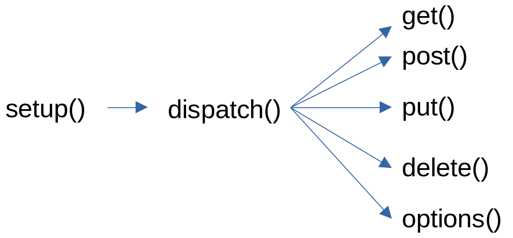
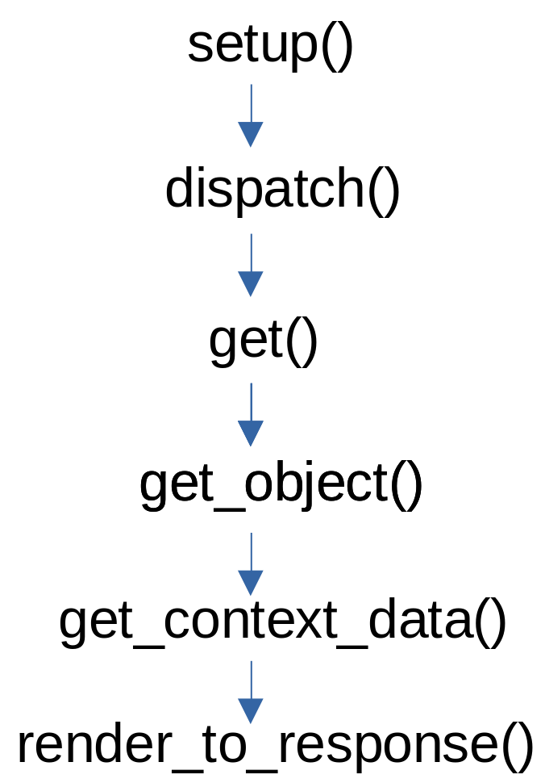
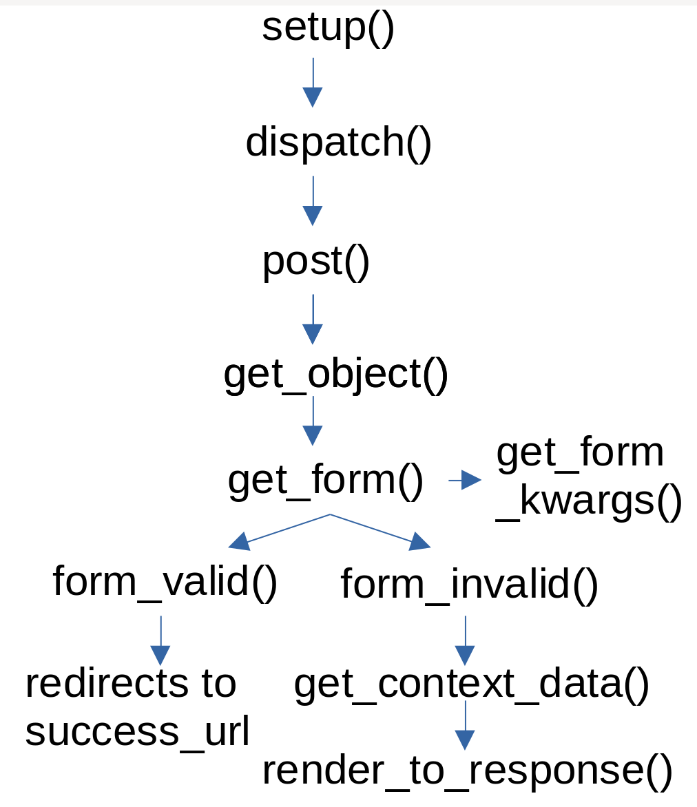

# Django

Django basic notes

Other good notes and cheatsheets I found:
* [Cheat-sheet - dev.to - Eric The Coder](https://dev.to/ericchapman/my-beloved-django-cheat-sheet-2056)


## COMMANDS

To create project:
* django-admin startproject <project_name>

Adding `python manage.py` ahead:

* startapp <app_name>
* makemigrations
* migrate
* runserver <addr:port>
  * Run the django development server. Do NOT use in production
  * Default ip and port: `127.0.0.1:8000`
  * To listen on all available public IPs: `runserver 0.0.0.0:8000`
* test
* collectstatic
* check
* createsuperuser
* changepassword <username>
* shell
  * interactive shell to run code in your django project


## URLs
Functions:
* `django.utls.path(route:str, view:funtion, kwargs:dict, name:str)`
* `django.urls.include(app_urls:str)`

Examples:
* `path('my_model/<int:my_model_id>/', views.my_view, name='my_view_name')`
* `path('my_model/<int:my_model_id>/', views.MyView.as_view(), name='my_view_name')`
* `path('my_app/', include('my_app.urls')),`


## MODELS

```python
from django.db import models

class OtherModel(models.Model):
    pass 

class MyModel(models.Model)
    name = models.Charfield('Customer', max_length=120)
    age = models.PositiveSmallIntegerField()
    note = models.TextField(blank=True, null = True)
    email = models.EmailField(max_length=255, blank=True, null=True)
    float_number = models.FloatField(blank=True)
    is_active = models.BooleanField(default=True)
    created_at = models.DateTimeField(auto_now_add=True)
    updated_at = models.DateTimeField(auto_now=True)
    quantity = models.PositiveIntegerField(null=True, blank=True)

    # Select Field (return value, display value)
    TYPE_CHOICES = (
        ('Customer', 'Customer'),
        ('Supplier', 'Supplier'),
        ('Student', 'Student'),
    )
    type = models.CharField(choices=TYPE_CHOICES)
    
    # RELATIONSHIPS
    
    # Many-to-One:
    other_model = models.ForeignKey(OtherModel, on_delete=models.CASCADE)

    # Many-to-Many: 
    other_models = models.ManyToManyField(OtherModel, blank=True)

    # One to One 
    other_model_one = models.OneToOneField(OtherModel, on_delete=models.CASCADE)
    
    # on_delete can be set to models.CASCADE, models.ST_DEFAULT or models.SET_NULL
    
    # Use a string with the class name if the entity is not yet declare
    other_model_2 = models.ForeignKey("OtherModel2", on_delete.CASCADE)
    
    # Relationship with User model
    user = models:foreignKey(settings.AUTH_USER_MODEL, on_delete=models.CASCADE)
    
class OtherModel2(models.Model):
    pass
```

Define ` def __str__(self): `. This methods will be used in templates, etc.


## FORMS

Fields:
* (ModelForm) instance
* errors
* cleaned_data
* template_name
* initial
* fields

Custom checkings of single fields in `clean_field_name()`, and general checkings in `clean()`. Raise a `ValidationError` if incorrect data. If you want to show more than one error to the user, you can use `add_error()` instead raising `ValidationError`.

```python
MyForm(forms.ModelForm):
    class Meta:
        model = MyModel
        fields = ['field1', 'field2']
    
    def clean_field1(self):
        field1 = self.cleaned_data['field1']
        if field1 > 5:
            raise ValidationError('Error message')
        return field1
    
    def clean_field2(self):
        field1 = self.cleaned_data['field2']
            if field2 > 5:
                self.add_error('field2', 'Error message')
         return field2
               
    def clean(self):
        return self.cleaned_data
```

If you want to implement custom behavior in a form, you usually have to override `save()` and/or `is_valid()`. This 2 mehtods the ones called in views.
```python
MyForm(forms.ModelForm):
    class Meta:
        model = MyModel
        fields = ['field1', 'field2']
    
    def save(self):
    	self.instance.updatings_count += 1
        return super().save()
```


Alternative way to organize fields, labels and widgets:
```python
MyForm(Form): 
    class Meta:
        fields= ['...', '...', '...']
        labels={'...':'...', '...':'...', '...':'...'}
        widgets={'...':forms.TextInput(attrs={'..':'..', ..}), ....}
```

## VIEWS

A view it is a function that it is called when a specific url is requested. That function receive at least the `request:HttpRequest` as first argument, and the url parameters (if there are) as second arguments. A view must return a HTTP response.

### Function-based views:

```python
# urls.py
`path('my_model/<int:my_model_id>/', views.my_view, name='my_view_name')`


# views.py
def my_view(request, my_model_id):
  .....
  .....
  return HttpResponse("Some response string")
```

Ways to make the HTTP response:
* Create django.http.HttpResponse object.
  * `HttpResponse('Some string')`
  * `HttpResponse(template.render(context:dict, request:HttpRequest))`
  * `shortcuts.render(request:HttpRequest, 'path/to/template.html', context)`
* Raising django.http.Http404 as HTTP response:
  * `raise Http404('Some text')`
  * `shortcuts.get_object_or_404(MyModel, pk=id)`
  * `shortcuts.get_list_or_404(MyModel, filter_parameter=value)`
* Create a django.http.HttpResponseRedirect (HTTP status code 302)
  * `HttpResponseRedirect()`
  * `shortcuts.redirect('/some/url')`


### Shortcuts

`render()`
`redirect()`
`get_object_or_404()`
`get_list_or_404()`


### Class-based views

[Best docs](https://ccbv.co.uk/)


#### View:
Inherit View and implement your methods `get()`, `post()`, etc. that you need.




#### TemplateView
Field: `template_name`
Override: `get_context_data()`

#### Generic display views: DetailView, ListView

Fields:
* `template_name = 'path/to/template.html'`
* `model = MyModel`
* (ListViews) `queryset = MyModel.objects.all()`
* (optional) `context_object_name = "custom_name"`
  * default: model name in lower case (+ `_list`)

Methods order:




#### Generic editing views: FormView, CreateView, UpdateView, DeleteView

Fields:
* `model = MyModel`
* `form_class = MyForm`
* `template_name = 'path/to/template.html'`
* `success_url = reverse_lazy('my_app:my_view')`
* (optionsl) `initial = {'filed':'data'}`

Methods order:




## TEMPLATES

In templates you can access objects in send in 'context'. 'user' and 'request' are always accesible.

```
{{ object.field }}

  

   

href=""

<form>  </form>

 


     



 

{{ title | lower }} 
{{ blog.post | truncatwords:50 }}
{{ order.date | date:"D M Y" }}
{{ list_items | slice:":3" }}
{{ total | default:"nil" }}
```


## STATIC FILES

Files that don't change and the templates use, like CSS and javascript files, images, audio, etc.

Static files should be in the folder 'static', inside every app. Also, if different apps use some same static files (or if you prefer doing it in this way), you can put everything in a general folder called 'static' in the project folder :
* `project_name/app1/static/app1/`
* `project_name/app2/static/app2/`
* `project_name/static/common_files  project_name/static/app1  project_name/static/app2`

To use them in templates:
```


```

In settings:
* `STATIC_URL`: URL where every static file will be accessible. Relative or absolute.
* `STATICFILES_DIRS`: Folders where static files are.
* `STATIC_ROOT`: Folder where static files will be gathered by `collectstatic` command.
* `django.contrib.staticfiles` must be in included in `INSTALLED_APPS`.

```python
STATIC_URL = 'static/'
STATICFILES_DIRS = [os.path.join(BASE_DIR, 'static')]
STATIC_ROOT = 'staticfiles/'
```
With this configuration, you can use static files in debug (development) mode. It works automatically.

For production mode, you can use `python manage.py collectstatic`. It gathers everything in a folder, so you can deploy static files easier where they should be in production. Steps:
1 Django looks for static files in folders listed in `STATICFILES_DIRS`.
2 Django looks for in `static` before in `app/static`, and choose the first option if there is a duplicate.
3 Django gather everything togheter in `STATIC_ROOT` folder.


## INITIAL DB DATA SEED (for installation, NOT for test)

Create a file in 'migrations' folder that will be executed after the migrations, and will seed the database. You can use `python manage.py makemigrations --empty yourappname` to create it.

Supponsing that there is already a `0001_initial.py` file in the folder 'migrations' in your app, and that this file contains every migration needed for the app:
```python
from django.db import migrations

def initial_data_seed(apps, schema_editor):
    Assembly = apps.get_model('app_name', 'MyModel')
    my_model = MyModel()
    my_model.name_text = 'Name'
    my_model.description_text = 'Some description'
    assembly.save()

class Migration(migrations.Migration):

    dependencies = [
        ('app_name', '0001_initial'),
    ]

    operations = [
        migrations.RunPython(initial_data_seed),
    ]
```


## AUTHENTICATION

### User class & methods
* Fields for data: `username, first_name, last_name, email, password, last_login, date_joined`
* Fields for security: `groups, user_permissions, is_staff, is_active`
* Attributes (always same value): `is_authenticated = True, is_anonymous = False`
* Methods (remember to use instead of fields directly):
  * `get_username()`
  * `set_password(raw_password)`
  * `check_password(raw_password)`

>Remember to use always ` User =  django.contrib.auth.get_user_model()` to get the User class.


### Django Auth

#### Methods
* `authenticate(request, username, password) -> User`
* `login(request, username)`
* `logout(request)`
* `logout_then_login(request)`
* `redirect_to_login(next)`


#### Default AUTH: views - forms - urls - template names

| **url names**		  	| **views**                 	| **forms**          	| **templates**                	|
|-------------------------	|---------------------------	|--------------------	|------------------------------	|
| login                   	| LoginView                 	| AuthenticationForm 	| login.html                   	|
| logout                  	| LogoutView                	|                    	| logged_out.html              	|
| password_change         	| PasswordChangeView        	| PasswordChangeForm 	| password_change_form.html    	|
| password_change_done    	| PasswordChangeDoneView    	|                    	| password_change_done.html    	|
| password_reset          	| PasswordResetView         	| PasswordResetForm  	| password_reset_form.html     	|
| password_reset_done     	| PasswordResetDoneView     	|                    	| password_reset_done.html     	|
| password_reset_confirm  	| PasswordResetConfirmView  	| SetPasswordForm    	| password_reset_confirm.html  	|
| password_reset_complete 	| PasswordResetCompleteView 	|                    	| password_reset_complete.html 	|
|                         	|                           	| UserCreationForm   	|                              	|
|                         	|                           	| UserChangeForm     	|                              	|

`PasswordResetView` also uses `password_reset_email.html` and `password_reset_subject.txt`.

Settings to use:
* `LOGIN_URL`: url of login page. Used by many parts of Django
* `LOGIN_REDIRECT_URL`: where redirects after login. Used by `LoginView`.
* `LOGOUT_REDIRECT_URL`: where redirects after logout. Used by `LogoutView`.
* `DEFAULT_FROM_MAIL`: Email sender email. Used by `PasswordResetView`.
* `PASSWORD_RESET_TIMEOUT`: In seconds. Time until you can reset the password since the email has been sent.

### Customizing auth

#### Extending User model. 2 options:

1 - Custom user model that extends `django.contrib.auth.models.AbstractUser`.
* Always create it BEFORE the first migration. Fix it after first migrations is impossible.
* If your custom user model has `is_active`, only users with `is_active = True` can be authenticated.
* In settings: `AUTH_USER_MODEL` must point to your new user model
* In admin: `admin.site.register(NewCustomUser, django.contrib.auth.admin.UserAdmin)`
* When refering it, use: `User = auth.get_user_model()`
  * Except in models and signals, where you must use: `settings.AUTH_USER_MODEL`: `user = models.OneToOneField(settings.AUTH_USER_MODEL, on_delete=models.CASCADE)`
* Although it is not common and not recommended, if your custom user model changes the basic fields of `AbstractUser`, you must do too:
  * Create a specific `UserManager`
  * Specify `USERNAME_FIELD`
  * Change `UserCreationForm` and `UserChangeForm`
  * Register class in admin, withour using `UserAdmin`

2 - OneToOneField pointing to the user model
* E.g.: model class Profile, with: `user = models.OneToOneField(User, on_delete=models.CASCADE)`
* `user.profile` for using it


#### Custom auth backend

In settings, add AUTHENTICATION_BACKENDS = [......]
> `[django..contrib.auth.backends.ModelBackend,` <- Default backend
>  `myproject.app1-backendsAuth.MyBackend]`
Create backend class that inherits from BaseBackend with 2 methods:
```python
class MyBackend(BaseBackend):
    authenticate(self, request, username, password) -> User
    get_user(user_id) -> User
```
`user_id` must be primary key


## AUTHORIZATION - PERMISSIONS

### Built-in permissions system (Model level permissions)

Best doc:[Permissions](https://testdriven.io/blog/django-permissions/)

For every model there are 4 types of permissions/actions: view, add, change, delete. Permissions can be set to a user o to a group. To check if a user has certain permission, you can use the ModelAdmin or the own user.

| **ModelAdmin**          	| **User**                        	|
|-------------------------	|---------------------------------	|
| has_view_permission()   	| user.has_perm('foo.view_bar')   	|
| has_add_permission()    	| user.has_perm('foo.add_bar')    	|
| has_change_permission() 	| user.has_perm('foo.change_bar') 	|
| has_delete_permission() 	| user.has_perm('foo.delete_bar') 	|

Permission naming sequence: {app}.{action}_{model_name}

To modify permissions:
* myuser.groups.set([group_list])
* myuser.groups.add(group, group, ...)
* myuser.groups.remove(group, group, ...)
* myuser.groups.clear()
* myuser.user_permissions.set([permission_list])
* myuser.user_permissions.add(permission, permission, ...)
* myuser.user_permissions.remove(permission, permission, ...)
* myuser.user_permissions.clear()


### Decorators and Mixins

Decorators for function based views. Mixins models for class based views.

| **decorators**           	| **mixins classes**      	|                               	|
|--------------------------	|-------------------------	|-------------------------------	|
| `@login_required`        	| LoginRequiredMixin      	| (False) -> settings.LOGIN_URL 	|
| `@staff_member_required` 	|                         	| For only staff and admins     	|
| `@user_passes_test`      	| UserPassesTestMixin     	| Custom test authorization     	|
| @permission_required     	| PermissionRequiredMixin 	| Built-in django permissions   	|

To use a mixin, simply make your view inherits the mixin class (the firist in the parents list): `class MyView(LoginRequiredMixin, View)`. `raise_exception` must be `True` to raise a 403 HTTP Forbidden error.

To use a decorator simply place it before the function view:
```python
@loguin_required
def my_view(request):
```

When your view inherits from `UserPassesTestMixin`, it must override `test_func()`, where you check if the user is authorized to that request, and return a boolean.
```python
class MyView(UserPassesTestMixin, UpdateView):
    def test_func(self) -> bool:
      ......
```

To use `user_passes_test` pass it callables as arguments. Those callabes must be functions that takes an user as argument and return a boolean.
```python
def my_test_func(user) -> bool:
  .....

@user_passes_test(my_test_func)
def my_view(request):
```

@permission_required example:
```python
@permission_required('polls.add_choice', raise_exception=True)
def my_view(request):
    ...
```

`PermissionRequiredMixin` example:
```python
class MyView(PermissionRequiredMixin, View):
    permission_required = 'polls.add_choice'
    # Or multiple of permissions:
    permission_required = ('polls.view_choice', 'polls.change_choice')
```

### Django Authorization Best Practices

Best doc: [Custom authorization](https://learndjango.com/tutorials/django-best-practices-user-permissions)

#### In class-based views:
* Inherits `LoginRequiredMixin`, `UserPassesTestMixin` in that order
* Override `test_func()`. Within it use `self.request.user` to get the user and `self.get_object()` to get the model instance in that view.
* (optional) Create authorization.py and place the functions that ckeck the permission there. Those functions must return a boolenan. Call them from `test_func()`.
* Field `raise_exception = False`.

```python
class BlogUpdateView(LoginRequiredMixin, UserPassesTestMixin, UpdateView):
    model = Post
    template_name = 'post_edit.html'
    fields = ['title', 'body']
    raise_exception = True
    def test_func(self):
        obj = self.get_object()
        return obj.author == self.request.user
```

#### In function based views:
* `@loguin_required`
* Create authorization.py and place the functions for checking permissions there. Those functions must raise a `PermissionDenied` or a `HttpResponseForbidden` if the user isn't allowed for that request.
* Call functions in authorization.py after getting the objects. 

```python
#views.py
@loguin_required
def my_view(request, my_model_id):
  my_model_object = get_object_or_404(MyModel, pk=my_model_id)
  authorization.check_permissions_my_model_my_view(my_model, request.user)

#authorization.py
def check_permissions_my_model_my_view(my_model:MyModel, user:User):
  if ....:
    raise PermissionDenied()
  else:
    ....
```


## TESTS

### Commands and TestCases

* `test my_app`
* `test my_app.tests_views`
* `test my_app.tests.test_views (if you have a 'tests' folder)`
* `test my_app.test_views.MyViewTestCase`

test*****.py -> name of every file used for test

Example of tests class:
```python
class MyTest(TestCase):
  @classmethod
    def setUpTestData(cls) 
      # Run once, before everything
    def setUp(self)
      # Run before every test
    def tearDown(self)
      # Run after every test
    test_1(self) 
      # every test method name must start with 'test'
    test_2(self): 
      self.assert....
      self.assert...
```
In `setUp()`: Every change in the data base will be automatically removed after the test. Thus it isn't needed to do it in `tearDown()`. Place in setUp() the initial commits for the data base.


### How to test: Methods to use and data to check

#### Testing Models:

Test model class methods, same as a normal python class

#### Testing Forms:

In a form object, test `is_valid()`, `errors[]` and `save()` methods/fields.
```python
data = {'field1':'data1', 'field2':'data2', ....}
form = MyForm(data=data)
self.assertTrue(form.is_valid())
self.assertEqual(form.errors['field1'],['error with data1'])
self.assertEqual(len(form.errors), 2)
object = form.save()
self.assertEqual(object.field1, 'data1')
```

#### Testing URLs

Just test if the url from the method `reverse()` is ok.
```python
url = reverse('my_app:my_view')
self.assertEqual(url, '/my_app/my_view/')
```

#### Testing Views:

Use `self.client` for HTTP requests and to retrieve the response. Check the HTTP response.
```python
#Checking redirects in login_required
response = self.client.get(reverse('my_app:my_view'), follow=True)
self.assertRedirects(response, reverse('accounts:login') + '?' + urlencode({'next': '/my_app/my_view/'}))

#Checking GET:
self.client.login(username='user', password='password')
response = self.client.get(reverse('my_app:my_view', args[NUMBER]))
self.assertEqual(response.status_code, HTTPStatus.OK)
self.assertTemplateUsed(response, 'path/to/template/template.html')
self.assertEqual(response.context['object'].field, 'data_to_check')

# Checking non-existent data:
self.client.login(username='user', password='password')
response = self.client.get(reverse('my_app:my_view', args[WRONG_NUMBER]))
self.assertEqual(response.status_code, 404)

# Checking non-authorized user:
self.client.login(username='non-authorized-user', password='password')
response = self.client.get(reverse('my_app:my_view', args[NUMBER]))
self.assertEqual(response.status_code, 403)
response = self.client.post(reverse('my_app:my_view', args[NUMBER]))
self.assertEqual(response.status_code, 403)

# Checking POST:
self.client.login(username='user', password='password')
data = {'field1':'wrong-data1', 'field2':'wrong-data2', ....}
response = self.client.post(reverse('my_app:my_view'), data=data)
self.assertEqual(response.status_code, HTTPStatus.OK)
self.assertTemplateUsed(response, 'path/to/template/template.html')
self.assertEqual(response.context['object'].field, 'data_to_check')
self.assertEqual(type(response.context['form']), forms.MyForm)
self.assertEqual(len(response.context['form'].errors), NUM_ERRORS)

# Checking POST valid data:
self.client.login(username='user', password='password')
data = {'field1':'data1', 'field2':'data2', ....}
response = self.client.post(reverse('my_app:my_view'), data=data)
self.assertRedirects(response, reverse('my_app:other_view'))
self.assertEqual(User.objects.filter(field='data').count(), NUM_OBJECTS)
self.assertEqual(User.objects.get(field1='data1').field2, 'data2')

# If you need to check the raw HTML (normaly not necessary
self.assertIn("stirng to check"), resp,content)
self.assertContains(resp, "string to check", html=True)
```
The response of a client.get() or client,post() is a object with the fields:
* client
* content: string with HTML generated
* context[]: list of objects
* request: request object used in views
* status_code: int(200, 404. 403, 500, etc)

#### Testing API:
Use `self.api_client`:
```python
self.api_client.get('/mymodel/23', format='json')
```

### Testing Best Practices

1. Test URLs
2. Test Models
3. Test Forms
   * Success case: Correct data. Check:
     * `form.is_valid()==True`
     * `len(form.errors)==0`
     * `form.save()` object fields has been change properly.
   * Wrong cases: empty fields, maximum length, incorrect_data. Check: 
     * `form.is_valid()==False`
     * `error['field']==['error text']`
     * `len(form.errors)==NUM_ERRORS`
4. Test Views
   * Use `self.client.login(username, password)` or `self.client.force_login()`
   * Use `self.client.get()` and `self.client.post()`
   * Check (pick the needed ones depending of the test): 
     * `resp.status_code == HttpStatus.OK | 404 | 403`
     * `self.assertTemplateUsed(resp, PATH_TO_TEMPLATE)`
     * `resp.context['object'].field = object.field`
     * `type(resp.context['form']) == forms.MyForm`
     * `len(resp.context['form'].errors) == NUM_ERRORS`
     * `self.assertRedirects()`
     * Data base changes: (`Model.objects.get()` / `filter()` / `count()`)
   * Test cases:
     1. GET POST Anonymous user -> should redirects to login
     2. GET logged user -> should show template with data and forms
     3. GET POST unauthorised user -> should return 403 error
     4. GET POST non-existed data -> should return 404 error
     5. POST blank & incorrect data -> should return form with errors
     6. POST valid data -> should redirects and change data base
5. Test APIs (if there are)
   * Test GET, POST, PUT and DELETE for every URL.
   * Wrong cases and success case, like in views testing


## FILES AND IMAGES

### Uploading files by users

First of all, you must:
* If you are going to store images, install pillow: `pip install pillow`
* To make your project able to work with files in DEBUG mode, you must add this code at the end of urls.py general file:
```python
if settings.DEBUG:
    urlpatterns += static(settings.MEDIA_URL, document_root=settings.MEDIA_ROOT)
```
Settings must have:
* `MEDIA_ROOT`: Absolute path to the directory that will hold the files 
  * It is common:`MEDIA_ROOT = os.path.join(BASE_DIR, 'media')`. For development at least.
* `MEDIA_URL`: URL that serves the files stored at this location

In models.py:
* Files: `models.FileField(upload_to='files/')`
* Images: `models.ImageField(upload_to='images/')`
* `upload_to` will be the folder within `MEDIA_ROOT` for storing the files.

In templates/HTML:
* For forms to upload file: modify `<form>` to: `<form enctype="multipart/form-data">`
* To show an image: ``

In forms.py:
* If ModelForm: Just add the field to Meta class
* If Form:
  * Files: `forms.FileField(... widget=forms.FileInput(attr={..})...)`
  * Images: `forms.ImageField(... widget=forms.FileInput(attr={..})...)`
  * Keep in mind that `ImageField`'s widget is `FileInput`

In views.py:
* Add `files=request.FILES` when creating a Form
  *e.g.: `MyForm(data=request.POST, files=request.FILES, ...)`

### Managing files

Not started.... the File class

	
## SECURITY

* [Security best practices](https://learndjango.com/tutorials/django-best-practices-security)

## PACKAGES TO USE

### django-axes: for preventing brute force attacks at login

### django-crispy-forms: for rendering 

## See also

