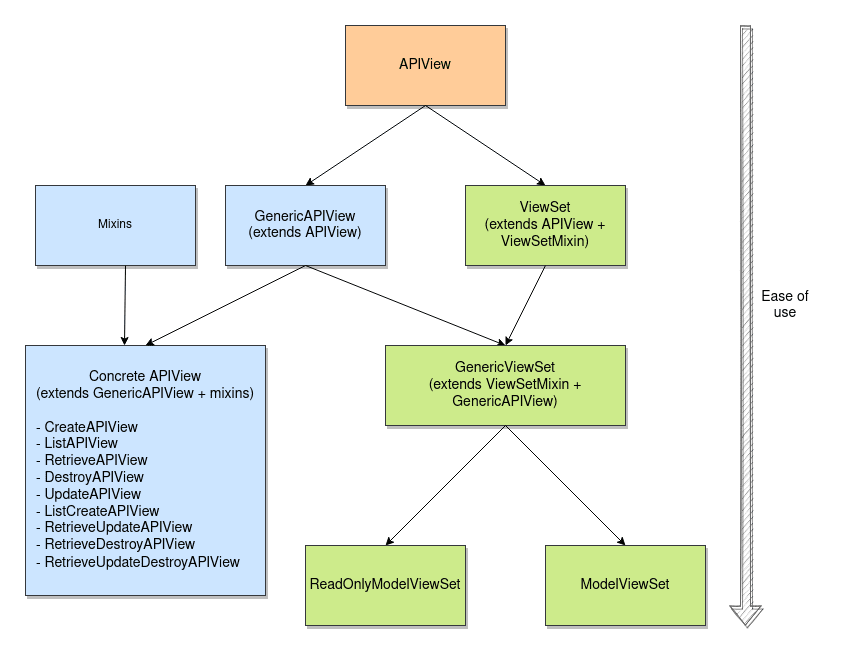

# Django REST Framework

Django REST Framework notes

Other good notes and cheatsheets I found:

[github Nifled](https://github.com/Nifled/drf-cheat-sheet)


## MODELS USED FOR EXAMPLES

```python
# Articles and its notes

class Article(models.Model):
    title = models.CharField(max_length=50)
    text = models.TextField(blank=True)
    created_at =  models.DateTimeField()

class Note(models.Model):
    title = models.CharField(max_length=50)
    text = models.CharField(max_length=256)
    created_at =  models.DateTimeField()
    article = models.ForeignKey(Article, related_name='notes', on_delete=models.CASCADE)

    def __str__(self):
        return str(self.title) + ' - ' + str(created_at)

```

## BASIC

DRF is composed of the following two components:
* __Serializers__ are used to: 
  * Convert Django querysets and model object instances to (serialization) and from (deserialization) python dictionary (that can then be easily rendered into JSON, XML, and other formats.).
  * As Django Form class does, they validate data
* __Views__ (along with ViewSets) are used to:
  * As they are similar to traditional Django views, handle RESTful HTTP requests and responses.
  * Use the serializers to validate incoming payloads and contain the necessary logic to return the response.
  * Views are coupled with routers, which map the views back to the exposed URLs.

## SERIALIZERS

Serializers are similiar to Django Forms in some aspects. To use them:


```python
#Serialize:
# Object instance -> Data dict
s = Serializer(instance)
s.data

#Deserialize and create:
# dict -> Object
s = Serializer(data={..})
s.is_valid()
instance = s.save()

#Validation:
s = Serializer(data={..})
if s.is_valid(raise_exception=False):
  s.validated_data
else:
  s.errors # dict(field=[problems..])

#Update:
s = Serializer(instance, data={...})
s.is_valid()
instance = s.save()
```

To create a serializer, we have to create a class that extends:
* Serializer 
* ListSerializer
* ModelSerializer (o HyperlinkedModelSerializer)


### Serializer

__Fields__:
* __Common__: CharField, ChoiceField, IntegerField, BooleanField, DateTimefield, UUIDField, JSONField, EmailField, URLField, FileField, ...
* __Relationships__: RelatedField, PrimaryKeyRelatedField SlugRelatedField, HyperlinkedRelatedField

__Field args__:
* read_only: Boolean. Default False
* write_only: Boolean. Default False
* required: Boolean. Default True
* allow_null: Boolean. Default False
* default: Any value depending of the field. If set, don't use the arg 'required'
* source: String. The name of the attribute that will be used to populate the field. May be a method that only takes a self argument, such as `URLField(source='get_absolute_url')`, or may use dotted notation to traverse attributes, such as `EmailField(source='user.email')`.
* validators: List of validator functions, such as `IntegerField(validators=[multiple_of_ten, less_than_20000])`.

__Methods__ :
* `create()`: Always needs to be overrided
* `update()`: Always needs to be overrided
* `save()`: Only override it for special behavior
* `validate_<field_name>()`: Such as `validate_title()`. They should return the validated value or raise a `serializers.ValidationError`.
* `validate()`: If you need to validate some fields together
* `is_valid()`: Don't override

```python
class SimpleSerializer(serializers.Serializer):
  name = serializers.CharField(max_length=128)
  field2 = serializers.IntegerField(required=false)
  ...

  def create(self, validated_data):
    ...
    return MyModel.objects.create(**validated_data)

  def update(self, instance, validated_data):
    # if self.partial
    instance.name = validated_data.get('name', instance.name)
    instance.field2 = validated_data.get('field2', instance.field2) 
    ...
    instance.save()
    return instance

  def save(self, **kwargs):
    # instance = super().save(**kwargs)
    nm = self.validated_data.get('name')
    ...
    instance = model_object.save()
    return instance

  # def validate_<field>(self, value):
  def validate_name(self, value):
    if not name:
      raise serializers.ValidationError('Name required')
    ...
    return name

  def validate(self, data):
    nm = data.get('name')
    if not nm:
      raise serializers.ValidationError({'name': ..})
    ...
    return validated_data
```


### ListSerializer

The `ListSerializer` class provides the behavior for serializing and validating multiple objects at once. You won't typically need to use `ListSerializer` directly, but should instead simply pass `many=True` when instantiating a serializer.

When a serializer is instantiated and `many=True` is passed, a `ListSerializer` instance will be created. The serializer class then becomes a child of the parent `ListSerializer`

The following argument can also be passed to a ListSerializer field or a serializer that is passed many=True:
* `allow_empty`: Dafault True
* `max_length`
* `min_length`


### ModelSerializer

ModelSerializer classes are simply a shortcut for creating serializer classes:
* An automatically determined set of fields.
* Simple default implementations for the create() and update() methods.

```python
class NoteSerializer(serializers.ModelSerializer):
    class Meta:
        model = Note
        fields = ['id', 'text']
        read_only_fields = ['id',]
```

__class Meta attributes__:
* model (class)
* fields (list)
* depth (int)
* read_only_fields (list)
* exclude (list)
* extra_kwargs (dict)


### HyperlinkedModelSerializer
```python
class ArticleSerializer(serializers.HyperlinkedModelSerializer):
    class Meta:
        model = Article
        fields = ['id', 'title', 'text', 'created_at', 'notes']
        read_only_fields = ['id','notes',]
```

Other way:
```python
class ArticleSerializer(serializers.ModelSerializer):
    notes = serializers.HyperlinkedRelatedField(many=True, view_name='note-detail', read_only=True)
    
    class Meta:
        model = Article
        fields = ('id', 'title', 'text', 'created_at', 'notes')
```

### Relationships

Remember to use `related_name=''` in model relationship fields, to avoid errors.

__PrimaryKeyRelatedField__:

```python
notes = serializers.PrimaryKeyRelatedField(many=True, read_only=True)
```
Json result:
```javascript
'notes': [
        89,
        90,
        91,
        ...
    ]
```

__StringRelatedField__:

```python
notes = serializers.StringRelatedField(many=True)
```
Json result:
```javascript
'notes': [
        'title 1 - 2021-01-01',
        'title 2 - 2021-01-01',
        'title 3 - 2021-01-05',
        ...
    ]
```

__SlugRelatedField__:

```python
notes = serializers.SlugRelatedField(
        many=True,
        read_only=True,
        slug_field='title'
     )
```
Json result:
```javascript
'notes': [
        'title 1',
        'title 2',
        'title 3',
        ...
    ]
```

__HyperlinkedRelatedField__:

```python
notes = serializers.HyperlinkedRelatedField(
        many=True,
        read_only=True,
        view_name='note-detail'
    )
```
Json result:
```javascript
'notes': [
        'http://www.example.com/api/notes/45/',
        'http://www.example.com/api/notes/46/',
        'http://www.example.com/api/notes/47/',
        ...
    ]
```

__HyperlinkedIndetityField__:

Only with HyperlinkedModelSerializer:

```python
class ArticleSerializer(serializers.HyperlinkedModelSerializer):
    note_listing = serializers.HyperlinkedIdentityField(view_name='note-list')
```
Json result:
```javascript
'note_listing': 'http://www.example.com/api/note_list/12/',
```


### Nested relationships

__Depth attrubute__:

```python
class ArticleSerializer(serializers.ModelSerializer):
    class Meta:
        model = Article
        fields = ['id', 'title', 'notes']
        depth = 1
```

__Nested nested__:
```python
class NoteSerializer(serializers.ModelSerializer):
    class Meta:
        model = Note
        fields = ['id','title', 'created_at']

class ArticleSerializer(serializers.ModelSerializer):
    notes = NoteSerializer(many=True, read_only=True)
```
Json result:
```javascript
'notes': [
        {'id': 1, 'title': 'Title 1', 'created_at': '2021-01-01'},
        {'id': 2, 'title': 'Title 2', 'created_at': '2021-01-01'},
        {'id': 3, 'title': 'Title 3', 'tecreated_atxt': '2021-01-05'},
        ...
    ],
```

__Nested and url__:
```python
class NoteSerializer(serializers.HyperlinkedModelSerializer):
    url = serializers.HyperlinkedIdentityField(
        view_name='note-detail',
        lookup_field='pk'
    )
    class Meta:
        model = Note
        fields = ['title', 'url']

class ArticleSerializer(serializers.ModelSerializer):
    notes = NoteSerializer(many=True, read_only=True)
```
Json result:
```javascript
'notes': [
        {'title': 'Title 1', 'url': 'http://www.example.com/api/notes/45/'},
        {'title': 'Title 2', 'url': 'http://www.example.com/api/notes/45/'},
        {'title': 'Title 3', 'url': 'http://www.example.com/api/notes/45/'},
        ...
    ],
```

## VIEWS - Function based 

Using the `@api_view` decorator

Other decorators: `@csrf_exempt`, `@renderer_classes`, `@parser_classes`, `@authentication_classes`, `@throttle_classes`, `@permission_classes`

```python
@api_view(('GET','POST'))
def note_list(request):
    if request.method == 'GET':
        notes = Note.objects.all()
        serializer = NoteSerializer(notes, many=True)
        return Response(serializer.data)
    elif request.method == 'POST':
        serializer = NoteSerializer(data=request.data)
        if serializer.is_valid():
            serializer.save()
            return Response(serializer.data, status=status.HTTP_201_CREATED)
        return Response(serializer.errors, status=status.HTTP_400_BAD_REQUEST)

@api_view(['GET', 'PUT', 'PATCH', 'DELETE'])
def note_detail(request, note_id):
    try:
        note = Note.objects.get(pk=note_id)
    except Note.DoesNotExist:
        return Response(status=status.HTTP_404_NOT_FOUND)

    if request.method == 'GET':
        serializer = NoteSerializer(note)
        return Response(serializer.data)

    elif request.method == 'PUT':
        serializer = NoteSerializer(note, data=request.data)
        if serializer.is_valid():
            serializer.save()
            return Response(serializer.data)
        return Response(serializer.errors, status=status.HTTP_400_BAD_REQUEST)

    elif request.method == 'PATCH':
        serializer = NoteSerializer(note, data=request.data, partial=True)
        if serializer.is_valid():
            serializer.save()
            return Response(serializer.data)
        return Response(serializer.errors, status=status.HTTP_400_BAD_REQUEST)

    elif request.method == 'DELETE':
        note.delete()
        return Response(status=status.HTTP_204_NO_CONTENT) 
```


## VIEWS - Class based

* [testdriven.io Spela 1](https://testdriven.io/blog/drf-views-part-1/)
* [testdriven.io Spela 2](https://testdriven.io/blog/drf-views-part-2/)
* [testdriven.io Spela 3](https://testdriven.io/blog/drf-views-part-3/)



There are 4 ways of doing class based views
* To extend APIView
* To extend GenericAPIView and mixins
* To extend concrete views (generics) (like ListCreateAPIView, or RetrieveUpdateAPIView)
* To extend set views (like ModelViewSet or ReadOnlyModelViewSet)

 But in real life, you'll __most likely use__ one of the following: __APIView, concrete views, and (ReadOnly)ModelViewSet__

Policy attributes:
* renderer_classes: JSONRenderer, BrowsableAPIRenderer, ...
* parser_classes: JSONParser, FileUploadParser, ...
* authentication_classes: TokenAuthentication, SessionAuthentication, ...
* permission_classes: IsAuthenticated, DjangoModelPermissions, ...
* throttle_classes: AnonRateThrottle, UserRateThrottle, ...
* content_negotiation_class: only custom content negotiation classes

Policy methods:
* check_permissions(self, request)
* check_object_permissions(self, request): In Generic Views or ViewSets
* check_throttles(self, request)
* perform_content_negotiation(self, request, force=False)

### APIView

```python
class NoteListApiView(APIView):
    def get(self, request, format=None):
        notes = Note.objects.all()
        serializer = NoteSerializer(notes, many=True)
        return Response(serializer.data)

    def post(self, request, format=None):
        serializer = NoteSerializer(data=request.data)
        if serializer.is_valid():
            serializer.save()
            return Response(serializer.data, status=status.HTTP_201_CREATED)
        return Response(serializer.errors, status=status.HTTP_400_BAD_REQUEST)


class NoteDetailApiView(APIView):
    def get_object(self, note_id):
        try:
            return Note.objects.get(pk=note_id)
        except Note.DoesNotExist:
            raise Http404

    def get(self, request, note_id, format=None):
        note = self.get_object(note_id)
        serializer = NoteSerializer(note)
        return Response(serializer.data)

    def put(self, request, note_id, format=None):
        note = self.get_object(note_id)
        serializer = NoteSerializer(note, data=request.data)
        if serializer.is_valid():
            serializer.save()
            return Response(serializer.data)
        return Response(serializer.errors, status=status.HTTP_400_BAD_REQUEST)

    def patch(self, request, note_id, format=None):
        note = self.get_object(note_id)
        serializer = NoteSerializer(note, data=request.data, partial=True)
        if serializer.is_valid():
            serializer.save()
            return Response(serializer.data)
        return Response(serializer.errors, status=status.HTTP_400_BAD_REQUEST)

    def delete(self, request, note_id, format=None):
        note = self.get_object(note_id)
        note.delete()
        return Response(status=status.HTTP_204_NO_CONTENT)
```


### Mixins & Generic

Attributtes:
* queryset
* serializer_class

Methods:
* get_queryset()
* get_object()
* get_serializer()

```python
class NoteList(mixins.ListModelMixin,
                  mixins.CreateModelMixin,
                  generics.GenericAPIView):
    queryset = Note.objects.all()
    serializer_class = NoteSerializer

    def get(self, request, *args, **kwargs):
        return self.list(request, *args, **kwargs)

    def post(self, request, *args, **kwargs):
        return self.create(request, *args, **kwargs)

class NoteDetail(mixins.RetrieveModelMixin,
                    mixins.UpdateModelMixin,
                    mixins.DestroyModelMixin,
                    generics.GenericAPIView):
    queryset = Note.objects.all()
    serializer_class = NoteSerializer

    def get(self, request, *args, **kwargs):
        return self.retrieve(request, *args, **kwargs)

    def put(self, request, *args, **kwargs):
        return self.update(request, *args, **kwargs)

    def patch(self, request, *args, **kwargs):
        return self.partial_update(request, *args, **kwargs)

    def delete(self, request, *args, **kwargs):
        return self.destroy(request, *args, **kwargs)
```


### Concrete Views

* CreateAPIView: POST (single)
* ListAPIView: GET (multiple)
* RetrieveAPIView: GET (single)
* DestroyAPIView: DELETE (single)
* UpdateAPIView: PUT/PATCH (single)
* ListCreateAPIView: POST (multiple)
* RetrieveUpdateAPIView: GET/PUT/PATCH (single)
* RetrieveDestroyAPIView: GET/DELETE (single)
* RetrieveUpdateDestroyAPIView: GET/PUT/PATCH/DELETE (single)

```python
class NoteList(generics.ListCreateAPIView):
    queryset = Note.objects.all()
    serializer_class = NoteSerializer


class NoteDetail(generics.RetrieveUpdateDestroyAPIView):
    queryset = Note.objects.all()
    serializer_class = NoteSerializer
```


### ViewSets

* ViewSet
* GenericViewSet
* ReadOnlyModelViewSet
* ModelViewSet

Actions:
* list: GET (multiple)
* create: POST
* retrieve: GET (single) (pk needed)
* update: PUT (pk needed)
* partial_update: PATCH (pk needed)
* destroy: DELETE (pk needed)

You can also create custom actions with the `@action` decorator.

```python
class NoteViewSet(viewsets.ModelViewSet):
    """
    This viewset automatically provides `list`, `create`, `retrieve`,
    `update` and `destroy` actions.
    """
    queryset = Note.objects.all()
    serializer_class = NoteSerializer
    
    def perform_create(self, serializer):
        serializer.save(owner=self.request.user)
```

Then in urls.py:

```python
note_list = NoteViewSet.as_view({
    'get': 'list',
    'post': 'create'
})
note_detail = NoteViewSet.as_view({
    'get': 'retrieve',
    'put': 'update',
    'patch': 'partial_update',
    'delete': 'destroy'
})
path('notes/', note_list, name='note-list'),
path('notes/<int:pk>/', note_detail, name='note-detail'),
```


__Routers__:

Routers are used for creating the urls for ViewSets
 ```python
router = routers.DefaultRouter()
router.register('notes', NoteViewSet)

urlpatterns = [
    path('', include(router.urls)),
]
```


### Other things with generic, concrete and viewsets

For custom behavior on creating(POST), you must override `perform_create(self, serializer)`.
```python
class MessageViewSet(viewsets.ModelViewSet):
    queryset = Message.objects.all()
    serializer_class = MessageSerializer

    def perform_create(self, serializer):
        serializer.save(author=self.request.user)
```

The same is possible with `perform_update(self, serializer)` and `perform_destroy(self, instance)`


## Requests and Responses

DRF Request extends HttpRequest
```python
request.POST  # Only handles form data.  Only works for 'POST' method.
request.data  # Handles arbitrary data.  Works for 'POST', 'PUT' and 'PATCH' methods.
```

DRF Response extends HttpResponse
Response object is a type of TemplateResponse that takes unrendered content and uses content negotiation to determine the correct content type to return to the client.
```python
if serializer.is_valid():
    serializer.save()
    return Response(serializer.data, status=status.HTTP_201_CREATED)
return Response(serializer.errors, status=status.HTTP_400_BAD_REQUEST)
```


## AUTHENTICATION

Usefull links:
* [DRF docs](https://www.django-rest-framework.org/api-guide/authentication/)
* [DRF auth 1](https://ilovedjango.com/django/rest-api-framework/authentication/authentication-django-rest-framework/)
* [DRF JWT](https://simpleisbetterthancomplex.com/tutorial/2018/12/19/how-to-use-jwt-authentication-with-django-rest-framework.html)

There are 5 types of authentications
* BasicAuthentication
* SessionAuthentication
* TokenAuthentication
* RemoteUserAuthentication
* JWT - JSON Web Token Authentication (You need aditional packages)

Setting authentication __globally__:
```python
REST_FRAMEWORK = {
    'DEFAULT_AUTHENTICATION_CLASSES': (
               'rest_framework.authentication.BasicAuthentication',
    ),
    'DEFAULT_PERMISSION_CLASSES':(
                'rest_framework.permissions.IsAuthenticated',
    ),
}
```

Setting authentication __per view__ (__class based__):
```python
class ClassBasedView(APIView):
    authentication_classes = [BasicAuthentication]
    permission_classes = [IsAuthenticated]
```

Setting authentication __per view__ (__function based__)
```python
@authentication_classes([BasicAuthentication])
@permission_classes([IsAuthenticated])
def function_based_view(request, format=None):
    pass
```

### BasicAuthentication

* we need to send the username and password for every request
* It uses HTTP header: __"Authorization":"Basic <base64(username:password)>"__
* Don't use in production (if you do it anyway, always with https)
* It needs to get and send csrf token cookie (__csrftoken__)
* You shouldn't never used Basic for production, only in testing-development

### SessionAuthentication

* We need to send username and password at initial request. Then from server response we get the session id cookie (sessionid) which stores in browser and gonna use that for requests.
* It uses HTTP header: __"Authorization Basic <token_string>"__ and the __cookie "sessionid"__
* It needs to get and send csrf token cookie (__csrftoken__)
* Good option if you only use the API from a browser
* The server has to store session data for every user and this increase the overhead.

### TokenAuthentication

* We need to send username and password at initial request. Then from server response we get the token and gonna use that for requests
* It uses HTTP header: __"Authorization: Token <token-string>"__
* It does NOT need to get and send any csrf token. The auth token does that function as well.
* Best option, specially if the API will be consumed from mobile or desktop apps

To use TokenAuthentication, you need to add `rest_framework.authtoken` to `INSTALLED_APPS`, in settings.py.

To request an authentication token using their username and password, use `ObtainAuthToken` or `obtain_auth_token()`
```python
# Add this to setting.py
import rest_framework.authtoken.views
path('api-token-auth/', views.obtain_auth_token, name='api-token-auth'),
```
By default, there are no permissions or throttling applied to the obtain_auth_token view. If you do wish to apply to throttle you'll need to override the view class, and include them using the throttle_classes attribute.


### RemoteUserAuthentication

* Rarely used. Primarly for intranets sites (private networks)
* This authentication scheme allows you to delegate authentication to your web server, which sets the REMOTE_USER environment variable. Remote authentication passes the responsibility of verifying a user's identity to a third party. Most of the time, the third party is a centralized single sign-on server that supports a protocol such as LDAP, CAS, or SAML.
* To use it, you must have django.contrib.auth.backends.RemoteUserBackend (or a subclass) in your AUTHENTICATION_BACKENDS setting


### JWT - JSON Web Token Authentication

* You need to install `rest_framework_simplejwt`
* It uses HTTP header: __"Authorization: Bearer <token-string>"__
* It does NOT need to get and send any csrf token.

Setting:
```python
# settings.py
INSTALLED_APPS = [
    'rest_framework',
    'rest_framework_simplejwt'
]

REST_FRAMEWORK = {
    'DEFAULT_AUTHENTICATION_CLASSES': [
        'rest_framework_simplejwt.authentication.JWTAuthentication',
    ],
}

# urls.py
from django.urls import path
from rest_framework_simplejwt import views as jwt_views

urlpatterns = [
    path('api/token/', jwt_views.TokenObtainPairView.as_view(), name='token_obtain_pair'),
    path('api/token/refresh/', jwt_views.TokenRefreshView.as_view(), name='token_refresh'),
]
```


## AUTHORIZATION - PERMISSIONS

Usefull links:
* [drf permissions](https://testdriven.io/blog/drf-permissions/)
* [drf built-in permissions](https://testdriven.io/blog/built-in-permission-classes-drf/)
* [drf custom permissions](https://testdriven.io/blog/custom-permission-classes-drf/)


### Built-in DRF Permission Classes

* AllowAny
* IsAuthenticated
* IsAuthenticatedOrReadOnly
* IsAdminUser
* DjangoModelPermissions
* DjangoModelPermissionsOrAnonReadOnly
* DjangoObjectPermissions (you'll need a permission backend that supports object-level permissions, like django-guardian)


### Custom Permissions

* Extends `permissions.BasePermission`
* Override `has_permission(self, request, view)->bool`: To check if the user has model permissions.
* Override `has_object_permission(self, request, view, obj)->bool`:  To check if the user has object permissions.
* (optional) Declare `message` attribute of custom error message

```python
class CustomPermission(BasePermission):
    def has_permission(self, request, view) -> bool:
        return True
    def has_object_permission(self, request, view, obj) -> bool:
        return True

```

When you use it, keep in mind:
* With an `APIView`, you must explicitly call `check_object_permission` to execute `has_object_permission` for all permission classes. 
* You don't need to do it with generic/concrete views and ViewSets. This will be handled for you by default. 
* Function-based views will need to check object permissions explicitly, raising PermissionDenied on failure.
* `has_permission` and `has_object_permission` will return `True` if you don't override them.
* `has_permission` is called before `has_object_permission`
* `has_object_permission` is never executed for list views (regardless of the view you're extending from) or when the request method is POST (since the object doesn't exist yet). Hence we need to restrict it from `has_permission method`.
* You will normally check `request.method`, `request.user`, `obj.owner` and `view.basename`
* Better use `permissions.SAFE_METHODS` for ('GET', 'HEAD', 'OPTIONS')


Example:
```python
class IsStaffAndOwnerOrReadOnly(BasePermission):

    def has_permission(self, request, view):
        return request.user.is_staff

    def has_object_permission(self, request, view, obj):
        if request.method in SAFE_METHODS:
            return True
        return obj.owner == request.user


class NoteDetailConcrete(generics.RetrieveUpdateDestroyAPIView):
    queryset = MyModel.objects.all()
    serializer_class = MyModelSerializer
    permission_classes = [IsAuthenticated, IsStaffAndOwnerOrReadOnly]
```

For global permissions:
```python
REST_FRAMEWORK = {
    'DEFAULT_PERMISSION_CLASSES': [
        'rest_framework.permissions.IsAuthenticated',
    ]
}
```
`DEFAULT_PERMISSION_CLASSES` will only work for the views or objects that don't have permissions explicitly set.


### Combining and Excluding Permission Classes

Normally you use this (This approach combines them so that permission is granted only if all of the classes return `True`):
`permission_classes = [IsAuthenticated, IsStaff, SomeCustomPermissionClass]`

Since DRF 3.9, you can combine permission classes using __AND (`&`)__, __OR (`|`)__, __NOT (`~`)__ and  __parentheses (`()`)__ logical operators:
`permission_classes = [(IsFinancesMember | ~IsTechMember) & IsOwner]`


### Best practices

__Django model permissions__: If you are using the Django's standard django.contrib.auth model permissions (view, add, change, delete). Just use `DjangoModelPermissions` and `DjangoModelPermissionsOrAnonReadOnly`. Add permissions to users or groups via admin view.

But, normally, you will use __custom permissions__. Then:
* Create your custom authentication classes in `permissions.py`
* Use `has_permission` for checks that don't need the object data. For checking data only related to the user, the request, the view, the current datetime, etc; but not to check object data.
* Use `has_object_permission` for checking every data from the object, or that is related to the object.
* Use always `IsAuthenticated`
* `permission_classes`: First `IsAuthenticated`, then your custom permission classes in order of importance
* If the view is unrestricted, use `AllowAny` to make it explicit
* Use `IsAdminUser` if needed 


## TESTING

Related to DRF, you only have to test serializers and views.

### How to test: Methods to use and data to check

__Testing Serializers__:

With serializer objects, test `is_valid()`, `errors[]`, and `save()`  methods/fields.

```python
# Check dict -> obj
data = {'field1':'data1', 'field2':'data2', ....}
serializer = MySerializer(data=data)
self.assertTrue(serializer.is_valid())
self.assertEqual(serializer.errors['field1'],['error with data1'])
self.assertEqual(len(serializer.errors), 2)
# Check save() - create()
object = serializer.save()
self.assertEqual(object.field1, 'data1')
self.assertEqual(object.field2, 'data2')
# Check save() - update()
serializer = MySerializer(object, data=data)
self.assertTrue(serializer.is_valid())
object = serializer.save()
self.assertEqual(object.field1, 'data1')

# Check obj -> dict
obj = MyModel()
obj.field1 = 'data1'
obj.field2 = 'data2'
serializer = MySerializer(obj)
self.assertEqual(serializer.data['field1', 'data1'])
```

__Testing Views__:

Use `APITestCase` instead of `TestCase` (or `APISimpleTestCase`, `APITransactionTestCase`, `APILiveServerTestCase`). That is a mirror of `TestCase` but uses a different client class: `APIClient`. Inside a class that extends `APITestCase`, you can use `self.client` directly.

When checking the validity of test responses, inspect the data that the response was created with (`response.data`), rather than inspecting the fully rendered response(`response.content`).

`APIClient`:
* methods: `get()`, `post()`, `put()`, `patch()`, `delete()`, `head()` and `options()`
* methods parameters: url, data, format=,
* e.g.: `client.post('/notes/', {'title': 'new idea'}, format='json')`
* If views use `SessionAuthentication`, you can use `client.login(username, password)`
* If views use `TokenAuthentication`, you can use `client.credentials()`.
  * `token = Token.objects.get_or_create(user__username='username')`
  * `self.client.credentials(HTTP_AUTHORIZATION='Token ' + token.key)`
* If you want to bypass authentication entirely, you can use `client.force_authenticate(user=user)`
* CSRF: By default CSRF validation is not applied when using `APIClient`. So you don't have to worry about it.

```python
url = reverse('mymodel-list')
data = {'field1': 'name1'}

response = self.client.post(url, data, format='json')

# Check response status
self.assertEqual(response.status_code, status.HTTP_201_CREATED)
# Check response data 
self.assertEqual(len(response.data), 1)
self.assertEqual(response.data, {'field1':'name1'})
# Check data base
self.assertEqual(MyModel.objects.count(), 1)
self.assertEqual(MyModel.objects.get().field1, 'name1')

```

Popular status to check (in status): `HTTP_200_OK`, `HTTP_201_CREATED`, `HTTP_202_ACCEPTED`, `HTTP_204_NO_CONTENT`, `HTTP_400_BAD_REQUEST`, `HTTP_403_FORBIDDEN`, `HTTP_404_NOT_FOUND`


### Testing Best Practices

__1 - Test everything but serializers and views__:
* Test models
* Test urls
* Test custom permissions, validators, ...

__2 - Test serializers__:
* Success case (dict -> obj): Correct data. Check: 
  * `serializer.is_valid()==True`
  * `len(serializer.errors)==0`
  * `serializer.save()` object fields has been changed/created properly.
* Wrong cases (dict -> obj): empty fields, maximum length, incorrect_data. Check: 
  * `serializer.is_valid()==False`
  * `serializer.errors['field']==['error text']`
  * `len(serializer.errors)==NUM_ERRORS`
* Succes case (obj -> dic): Just check if every field is correct:
  * `serializer.data` dict data is correctly parsed from the object

  __3 - Test views__:
* If SessionAuthentication, use `self.client.login(username, password)`
* If TokenAuthenticationUse `self.client.credentials(HTTP_AUTHORIZATION='Token ' + token.key)`
* Use `self.client`
* Check (pick the needed ones depending of the test): 
  * `resp.status_code == rest_framework.status.HTTP_200_OK | 201 | 404 | 403`
  * `len(response.data) == NUM_FIELDS(one) or NUM_RESULTS(many)`
  * `response.data == {dict}`
  * Data base changes: (`Model.objects.get()` / `filter()` / `count()`)

Test cases:
1. GET POST PUT DELETE anonymous user -> should return 403 error
2. GET POST PUT DELETE unauthorised user -> should return 403 error
3. GET POST PUT DELETE non-existed data -> should return 404 error
4. GET valid data -> should return 200
5. POST PUT blank & incorrect data -> should return 400
6. POST PUT valid data -> should return 200|201|202|204 and change data base
7. DELETE valid data -> should return 200|202|204 and change data base